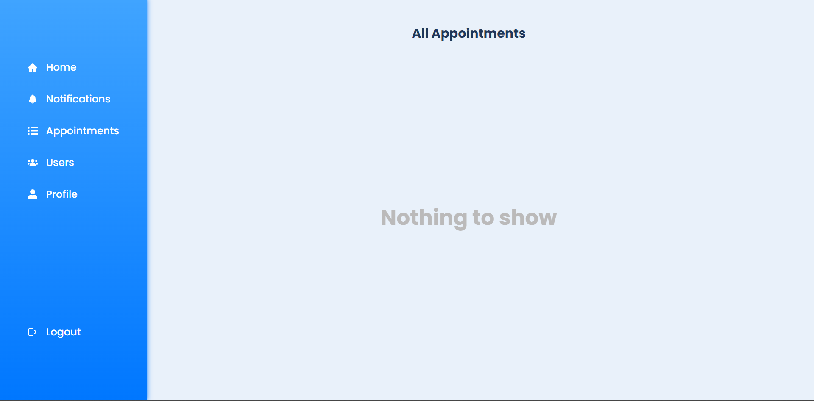

# HealthBooker🧑‍⚕️

<h3>Description :</h3> 
This is a webapp where you can book an appointment with a doctor.

👉[Click here](https://healthbooker.onrender.com/) to check out the app.
 

### 📃Features :

<ul>
<li>User can register and login</li>
<li>User can also apply for becoming a doctor on our site</li>
<li>User can book an appointment of their own choice</li>
</ul>

### Sign up page

### Sign in page

### Home page

### Profile page

### Appointments page

### Notifications page

### Users page

### Tools and technologies used :

 

### Connect with me :

