# HealthBooker🧑‍⚕️

<h3>Description :</h3> 
This is a webapp where you can book an appointment with a doctor.

👉[Click here](https://healthbooker.onrender.com/) to check out the app.
<br/>

### 📃Features :

<ul>
<li>User can register and login.</li>
<li>You can view all available doctors on the site.</li>
<li>You can also update your profile.</li>
<li>You can also send your queries to us from the contact section.</li>
<li>You can view all your notifications in the notifications tab.</li>
<li>There is also an admin managment system.</li>
<li>You can only access your notications, profile, appointments, doctor application if you're logged in</li>
<li>User can also apply for becoming a doctor on our site.</li>
<li>User can book an appointment with the doctor of their own choice.</li>
<li>Admin has the control to accept any user's request to become a doctor.</li>
<li>Admin can also remove any user or doctor from the site.</li>
<li>Doctor and Admin have the control to mark if the appointment is completed.</li>
<li>User will recieve notification if their application is accepted or rejected.</li>
<li>User and Doctor will recieve notification if their appointment is completed.</li>
<li>Doctor will recieve notification if someone booked appointment with them.</li>
<li>All the data will be stored on the database so there is no chance of losing you information.</li>
</ul>

<hr/>

### To run the project on your local machine

<ol>
<li>Download the project from the git repository</li>
<li>Add .env file in root directory for the backend which contains</li>

```
PORT=5000
MONGO_URI=YOUR_OWN_MONGODB_URL
JWT_SECRET=YOUR_JWT_SECRET
```
<li>Add .env file in client directory for the frontend which contains</li>

```

REACT_APP_SERVER_DOMAIN=http://127.0.0.1:5000/api
REACT_APP_CLOUDINARY_BASE_URL=https://api.cloudinary.com/v1_1/{CLOUD_NAME}/image/upload
REACT_APP_CLOUDINARY_CLOUD_NAME=YOUR_OWN_CLOUDINARY_CLOUD_NAME
REACT_APP_CLOUDINARY_PRESET=YOUR_OWN_CLOUDINARY_PRESET
```
**Note:** Replace the **{CLOUD_NAME}** with your own cloudinary cloud name

<li>To run the backend, go to root directory in the terminal and execute: npm start</li>
<li>To run the frontend, open a new terminal and run 'cd client/' to go to client directory and execute: npm start</li>
</ol>

### To access the admin dashboard

<ol>
<li>Download the project from the git repository</li>
<li>You need to create your own MongoDB instance and add the MongoDB url to the .env file</li>
<li>Register on the website and go to your MongoDB and manually change the 'isAdmin' field of the account you want to make admin in the DB to 'true' and then log in back on the site</li>
<li>Now you will be able to access the admin dashboard</li>
</ol>

### Home page

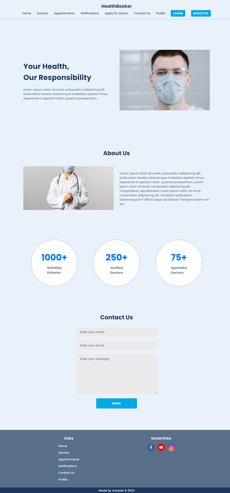

### Sign up page

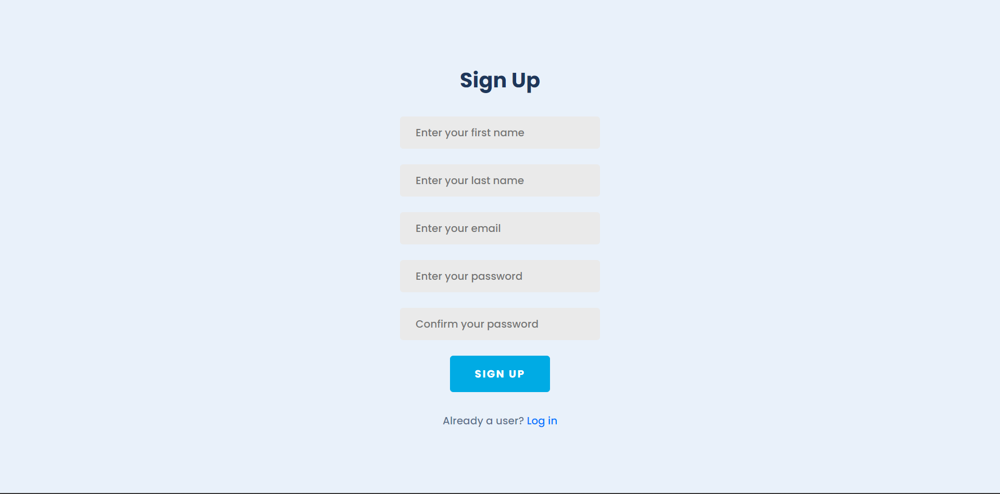

### Sign in page

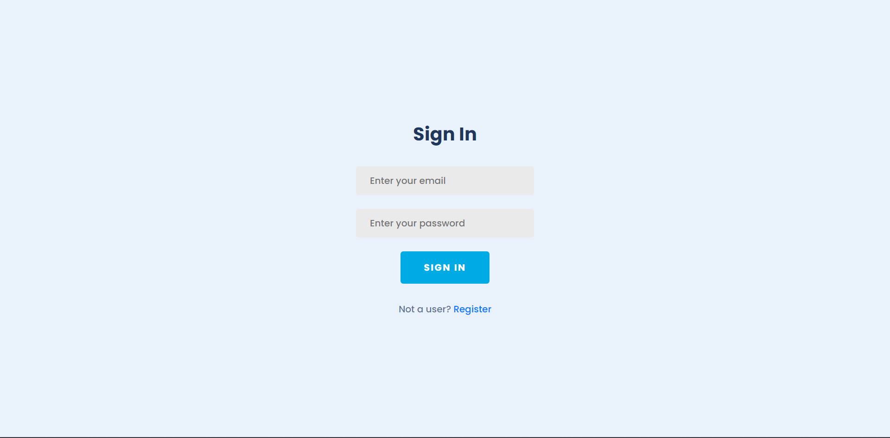

### Profile page

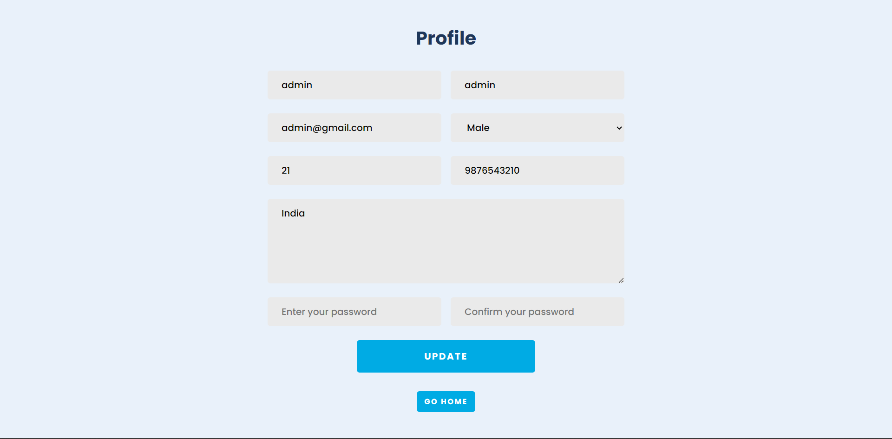

### All Doctors page

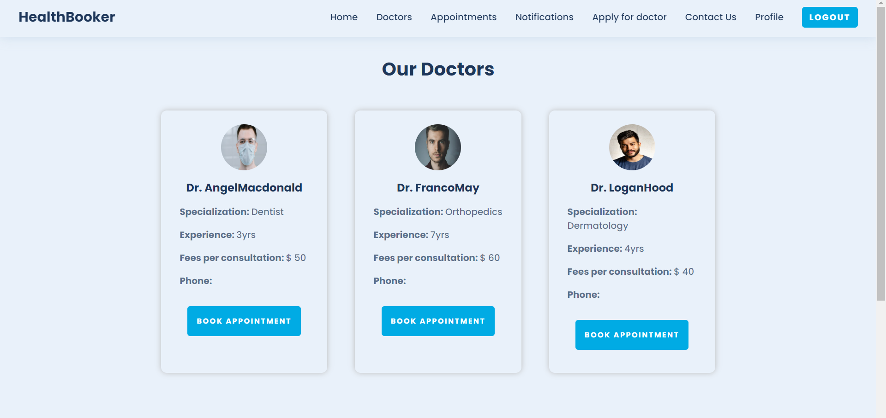

### Apply for doctor page

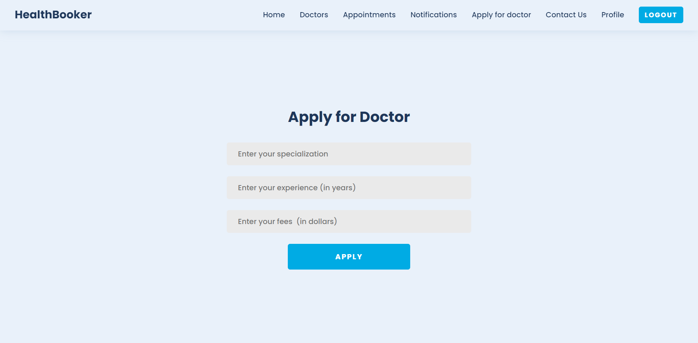

### Admin all users dashboard

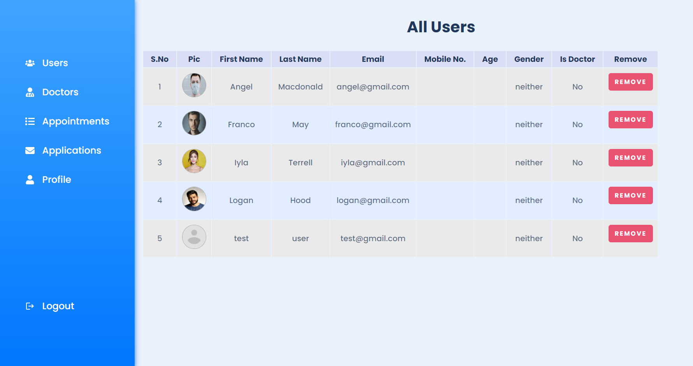

### Admin all applications page

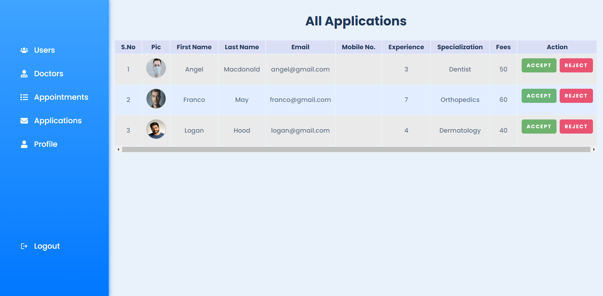

### Book Appointment page

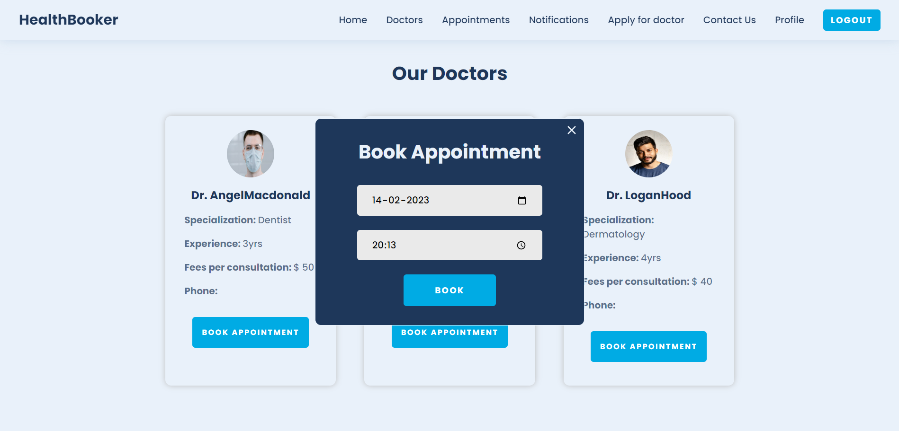

### Users all appointments page

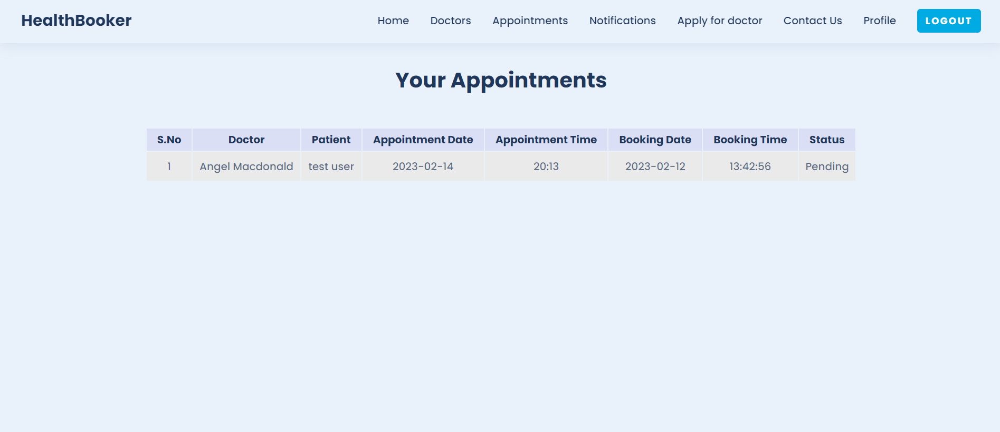

### Doctors all appointments page

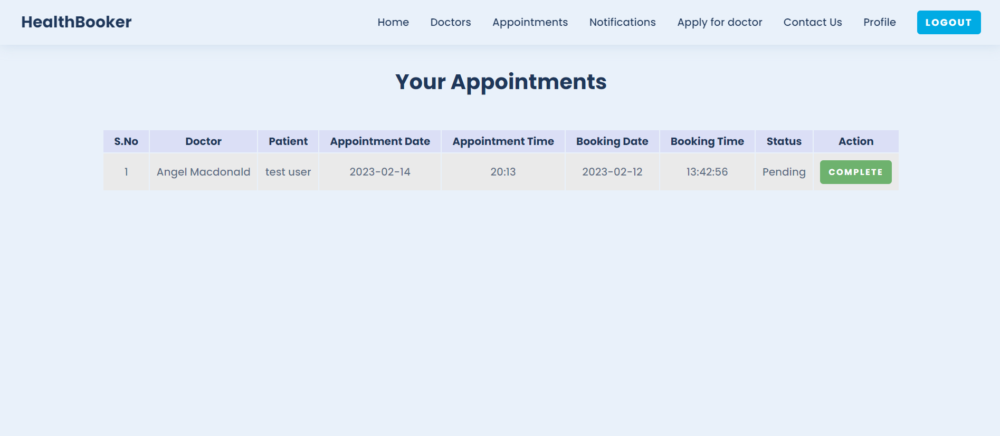

### Notifications page

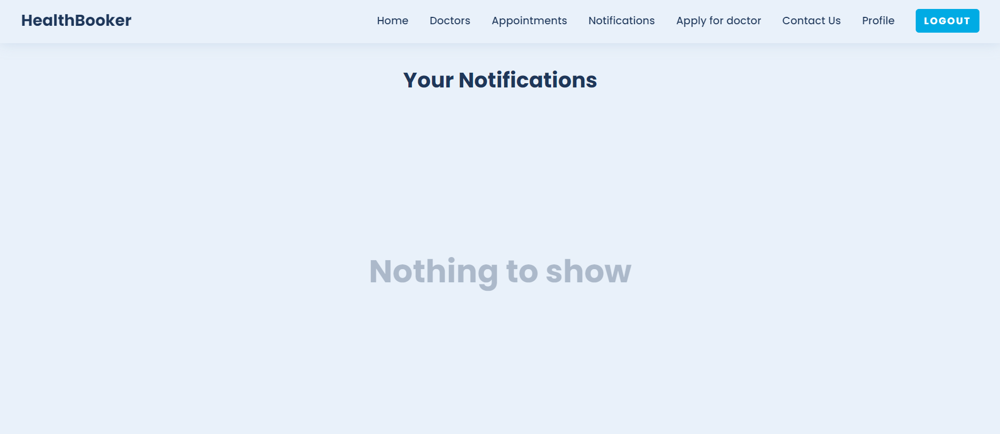

<hr/>

### Tools and technologies used :

<a href="https://www.w3.org/html/" target="_blank" rel="noreferrer">  </a>
<a href="https://www.w3schools.com/css/" target="_blank" rel="noreferrer">  </a>
<a href="https://developer.mozilla.org/en-US/docs/Web/JavaScript" target="_blank" rel="noreferrer">  </a>
<a href="https://reactjs.org/" target="_blank" rel="noreferrer">  </a>
<a href="https://nodejs.org" target="_blank" rel="noreferrer">  </a>
<a href="https://expressjs.com" target="_blank" rel="noreferrer">  </a>
<a href="https://www.mongodb.com/" target="_blank" rel="noreferrer">  </a>
<a href="https://redux.js.org" target="_blank" rel="noreferrer">  </a>
<br/>

### Connect with me :

<a href="https://twitter.com/avinashdunna" target="blank"></a>
<a href="https://twitter.com/avinashdunna" target="blank"></a>
